# AWS構成設計

このアプリケーションをAWS上で動かすための構成を定める。対象は **CloudFront / S3 / ALB / ECS+Fargate / RDS** の5サービスで、利用者からの窓口をCloudFrontに一本化する。

前提として、この構成は**学習目的の最小構成**である。可用性よりコストを優先した箇所が複数あり、そのすべてを「学習用の割り切り」の節に列挙してある。本番運用する場合に何を変えるべきかも同じ節に書いた。

## 構成図

```mermaid
flowchart TD
    U["ブラウザ（利用者）"] -->|HTTPS| CF

    subgraph CFD["CloudFront ─ dxxxx.cloudfront.net（唯一の窓口）"]
      direction LR
      CF{{"ビヘイビア振り分け"}}
      B2["default<br/>S3 静的オリジン・OAC<br/>CachingOptimized"]
      B3["/images&#42;<br/>S3 画像オリジン・OAC<br/>署名付き Cookie・CachingOptimized"]
      B1["/api&#42;<br/>ALB オリジン<br/>CachingDisabled・Cookie 全転送"]
      CF --> B2
      CF --> B3
      CF --> B1
    end

    B2 --> S3F[("S3 静的サイトバケット<br/>frontend/dist・完全非公開")]
    B3 --> S3I[("S3 画像バケット<br/>完全非公開")]
    B1 -->|"HTTP:80<br/>＋シークレットヘッダー"| ALB

    subgraph VPC["VPC 10.0.0.0/16"]
      direction TB
      subgraph PUB["public subnet ×2AZ（NAT なし・IGW 経由で外部へ）"]
        direction TB
        ALB["ALB internet-facing<br/>CloudFront 以外は 403"]
        ECS["ECS Service / Fargate<br/>backend:8080・0.25vCPU/512MB<br/>desired 1・assign_public_ip"]
        ALB -->|"TG :8080<br/>HC /api/health"| ECS
      end
      subgraph PRI["private subnet ×2AZ（IGW へのルート無し）"]
        RDS[("RDS PostgreSQL 16<br/>db.t4g.micro / gp3 20GB<br/>Single-AZ・非公開")]
      end
      ECS -->|":5432"| RDS
    end

    ECS -->|"IGW 経由"| EXT["ECR / SSM Parameter Store"]
    U -.->|"アップロードのみ<br/>presigned PUT で直接"| S3I
```



<details><summary>同じ図（mermaidが描画されない環境向けのテキスト版）</summary>

```text
▣ ブラウザ（利用者）
│
│ HTTPS
▼
┌─ CloudFront ─ dxxxx.cloudfront.net ── ユーザーからの唯一の窓口
│
├─▶ default ビヘイビア … S3 静的オリジン(OAC)・CachingOptimized
│     │                   CF Function で SPA fallback
│     ▼
│   ▣ S3: 静的サイトバケット … frontend/dist・完全非公開
│
├─▶ /images/* ビヘイビア … S3 画像オリジン(OAC)・CachingOptimized
│     │                    CloudFront 署名付き Cookie で保護
│     ▼
│   ▣ S3: 画像バケット … 完全非公開
│
└─▶ /api/* ビヘイビア … CachingDisabled（意図的に無効）
      │                  Cookie/ヘッダー/クエリを全転送
      │ HTTP:80 ＋ シークレットヘッダー
      ▼
┏━ VPC 10.0.0.0/16 ━━━━━━━━━━━━━━━━━━━━━━━━━━━━━━━━━━━━━━━━━━━━━━━━
┃
┃ ┌─ public subnet × 2AZ（NAT ゲートウェイ無し・IGW 経由で外部へ）
┃ │
┃ │  ▣ ALB（internet-facing）
┃ │       CloudFront のプレフィックスリスト＋ヘッダー一致以外は 403
┃ │     │
┃ │     │ TG :8080 ／ ヘルスチェック /api/health
┃ │     ▼
┃ │  ▣ ECS Service / Fargate
┃ │       backend:8080・0.25vCPU/512MB・desired 1・assign_public_ip
┃ └─────│────────────────────────────────────────────────────────────
┃       │ :5432（RDS の SG は ECS タスクの SG からのみ許可）
┃ ┌─────▼────────────────────────────────────────────────────────────
┃ │  private subnet × 2AZ（IGW へのルート無し）
┃ │
┃ │  ▣ RDS PostgreSQL 16
┃ │       db.t4g.micro / gp3 20GB / Single-AZ / パブリックアクセス無効
┃ └──────────────────────────────────────────────────────────────────
┗━━━━━━━━━━━━━━━━━━━━━━━━━━━━━━━━━━━━━━━━━━━━━━━━━━━━━━━━━━━━━━━━━━

【CloudFront を通らない経路（2つだけ残る）】
  ブラウザ ┈┈▶ ▣ S3: 画像バケット … アップロードのみ presigned PUT で直接
  ECS      ┈┈▶ ▣ ECR / SSM Parameter Store
                  … IGW 経由でイメージ取得・DBパスワード/JWT秘密の取得
```

</details>

## キャッシュ方針

| 経路 | キャッシュポリシー | キャッシュされるか |
|---|---|---|
| default（静的サイト） | `CachingOptimized` | **される**。Viteの出力はファイル名にハッシュが付く(`assets/index-a1b2c3.js`)ため長期キャッシュして安全。`index.html`のみ`no-cache`を付けてデプロイ時にinvalidateする |
| `/images/*` | `CachingOptimized`（署名Cookieはキャッシュキーに含めない） | **される**。URLが`/images/posts/<key>`で固定なので、エッジキャッシュもブラウザキャッシュも効く |
| `/api/*` | `CachingDisabled` | **されない(意図的)** |

`/api/*`をキャッシュしないのは性能上の妥協ではなく安全性の判断である。このAPIはCookieのJWTで認証しており、レスポンスが閲覧者ごとに異なる(タイムラインの`is_liked`、フォロー中フィード、`/api/auth/me`)。CDNでキャッシュすると、ある利用者向けのレスポンスが別の利用者に配られる事故になる。利用者単位でキャッシュキーを分ける方法もあるが、ヒット率がほぼ出ないうえ設定を誤ったときの被害が大きいため採らない。

APIレスポンスの転送量削減は、CDNではなくgzip圧縮で既に対応済みである(`application.yml`の`server.compression`)。実測でコメント502件の投稿が163.2KB→8.1KB(95.1%削減)、フィード20件が7.3KB→0.7KB(89.8%削減)となっている([パフォーマンステスト結果](perf-test-report.md) 5-3)。

## 設定値

### ネットワーク

| 項目 | 値 |
|---|---|
| VPC CIDR | `10.0.0.0/16` |
| public subnet | `10.0.0.0/24`(AZ-a) / `10.0.1.0/24`(AZ-c) |
| private subnet | `10.0.10.0/24`(AZ-a) / `10.0.11.0/24`(AZ-c) |
| インターネットゲートウェイ | あり(publicサブネットのルートテーブルのみ`0.0.0.0/0`を向ける) |
| NATゲートウェイ | **なし** |
| ALBのSG | インバウンド: マネージドプレフィックスリスト`com.amazonaws.global.cloudfront.origin-facing`から:80のみ |
| ECSタスクのSG | インバウンド: ALBのSGから:8080のみ。アウトバウンドは全許可 |
| RDSのSG | インバウンド: ECSタスクのSGから:5432のみ |

ALBとRDSサブネットグループはどちらも2AZ以上を要求するため、サブネットは最低限2AZ分用意する。冗長化しているのはこの制約を満たすためであり、実際に稼働するタスクとDBインスタンスは各1つである。

### ALB

| 項目 | 値 |
|---|---|
| スキーム | internet-facing |
| リスナー | HTTP:80 |
| デフォルトアクション | **403の固定レスポンス** |
| 転送条件 | CloudFrontが付与するカスタムオリジンヘッダーの値が一致すること |
| ターゲットグループ | HTTP:8080 / target_type=ip |
| ヘルスチェック | `GET /api/health` / interval 30s / healthy 2 / unhealthy 3 / matcher 200 |
| idle timeout | 60秒(既定のまま) |

### ECS / Fargate

| 項目 | 値 |
|---|---|
| 起動タイプ | Fargate |
| ネットワークモード | awsvpc / publicサブネット / `assign_public_ip = true` |
| CPU / メモリ | 0.25 vCPU / 512 MB |
| desired count | 1 |
| デプロイ | circuit breaker 有効 + 自動ロールバック有効 |
| ログ | awslogsドライバ → CloudWatch Logs |

環境変数(平文):

| 変数 | 値 |
|---|---|
| `DB_HOST` / `DB_PORT` / `DB_NAME` / `DB_USER` | RDSのエンドポイントと接続情報 |
| `STORAGE_S3_BUCKET` / `STORAGE_S3_REGION` | 画像バケット名 / `ap-northeast-1` |
| `STORAGE_S3_ENDPOINT` | **空文字を明示的に渡す** |
| `CORS_ALLOWED_ORIGIN` | `https://<CloudFrontドメイン>` |
| `COOKIE_SECURE` | `true` |
| `CDN_BASE_URL` / `CDN_KEY_PAIR_ID` | `https://<CloudFrontドメイン>` / CloudFront公開鍵のID |

`STORAGE_S3_ENDPOINT`に空文字を渡すのを忘れると、`application.yml`の既定値がLocalStack向けの`http://localhost:4566`であるため、コンテナ内から到達できないアドレスに接続しに行って起動に失敗する。既定値がローカル開発向けであることに起因する罠なので、タスク定義で必ず明示する。

SSM Parameter Store(SecureString)から注入する秘密:

| 変数 | 内容 |
|---|---|
| `DB_PASSWORD` | Terraformの`random_password`で生成 |
| `JWT_SECRET` | 同上 |
| `CDN_PRIVATE_KEY` | CloudFront署名用の秘密鍵(`tls_private_key`で生成) |

Secrets Managerではなく Parameter Store を使うのは、SecureStringが無料枠で扱えるためである。学習用途で秘密の数が少なく、自動ローテーションも不要なため、月額$0.40/シークレットを払う理由がない。

### RDS

| 項目 | 値 |
|---|---|
| エンジン | PostgreSQL 16 |
| インスタンスクラス | db.t4g.micro |
| ストレージ | gp3 20GB |
| Multi-AZ | **なし** |
| パブリックアクセス | 無効 |
| 配置 | privateサブネット |
| バックアップ保持 | 1日 |
| `skip_final_snapshot` | `true`(学習用の割り切り) |
| `deletion_protection` | `false`(学習用の割り切り) |

**接続数の検算**: `application.yml`のコメントが定めた「タスク数 × maximum-pool-size ≦ RDSのmax_connections」を確認する。1タスク × 10 = 10 に対し、db.t4g.microのmax_connectionsは約112であり成立する。タスク数を増やす場合はこの式が上限の根拠になる(11タスクで上限に達する)。

### CloudFront

| 項目 | 値 |
|---|---|
| ドメイン | CloudFrontのデフォルトドメイン(`*.cloudfront.net`)。独自ドメイン・ACM証明書は使わない |
| オリジン1 | 静的サイトS3(OAC) |
| オリジン2 | 画像S3(OAC) |
| オリジン3 | ALB(`http-only` / port 80 / カスタムヘッダー付与) |
| ビヘイビア(default) | オリジン1 / `CachingOptimized` / CloudFront Functionで SPA fallback |
| ビヘイビア(`/images/*`) | オリジン2 / `CachingOptimized` / `trusted_key_groups`で署名付きCookieを要求 |
| ビヘイビア(`/api/*`) | オリジン3 / `CachingDisabled` / オリジンリクエストポリシー`AllViewer` / 全HTTPメソッド許可 |

**SPAのフォールバックはカスタムエラーレスポンスではなくCloudFront Functionで実装する。** カスタムエラーレスポンスはディストリビューション全体に適用されるため、APIが返す403や404まで`index.html`に書き換えてしまい、フロントエンドがJSONを期待している箇所でHTMLを受け取ることになる。拡張子を持たないURIだけを`/index.html`に書き換えるビューアリクエスト関数を作り、defaultビヘイビアにのみ紐づける。

## 設計判断とその理由

### 1. 単一ドメイン方式にする

CloudFrontを1つだけ作り、静的ファイル・API・画像のすべてを同じドメインから配信する。ブラウザから見て同一オリジンになるため、次の3つが同時に解決する。

- `frontend/src/api/client.ts`の`credentials: "include"`がクロスサイトにならない
- `CorsConfig`の許可オリジン設定が実質不要になる(設定は残すが、通常の経路では使われない)
- 認証Cookieも画像の署名Cookieも`SameSite=Lax`のまま素直に飛ぶ

分離方式(CloudFrontは静的のみ、APIはALBを直接叩く)を採ると、クロスサイトCookieになるため`SameSite=None; Secure`への変更が必須になり、さらにALB用の独自ドメインとACM証明書が必要になる(`*.elb.amazonaws.com`にHTTPSを張るには証明書が要るため)。今回はデフォルトドメインのみで済ませたいので、単一ドメイン方式を選ぶ。

### 2. 画像をCloudFront経由・署名付きCookieで配信する

これまでは表示用URLもPresigned URLで発行していた。この方式には2つの問題がある。

**キャッシュが効かない。** Presigned URLは署名がクエリ文字列に入るため、発行のたびにURLが変わる。CDNを通してもキャッシュキーが毎回変わるのでヒットしない。これはCloudFrontの**署名付きURL**に置き換えても同じで、解決しない。

**署名付きURLは「持っている人が誰でも使える」資格情報である。** URLの文字列さえあればログイン不要で画像を取得できるため、次の経路で意図せず外部に出る。DevToolsで誰でも見える / 利用者が画像アドレスをコピーしてチャットに貼る(リンクプレビュー生成のため受信側サービスも自動取得する) / 画像を新しいタブで開いた後の遷移でRefererに載る / ブラウザ履歴や社内プロキシのログに残る。しかも発行後に個別失効させる手段がない。

**署名付きCookie**にすると、URLが`/images/posts/<key>`という秘密でない固定文字列になり、資格情報はHttpOnly Cookieに移る。上記の漏洩経路がまとめて塞がり、同時にキャッシュキーが安定するのでエッジキャッシュもブラウザキャッシュも効くようになる。

副次的な効果として、`app.storage.s3.presign-expiry`が24時間になっている理由(「フロントエンドがレスポンスをキャッシュするため、短くするとキャッシュ内のURLだけ先に失効して画像が壊れる」)が消える。URLが固定なら失効を気にする必要がないため、**署名の寿命だけを12時間に短縮し、トークンのリフレッシュのたびに再発行する**設計にできる。

**CDNが無いローカル環境ではS3の署名付きURLにフォールバックする。** LocalStackはS3しか持たずCloudFrontが存在しないため、この分岐が無いと開発環境で画像が一切表示できない。`CDN_BASE_URL` が空のときにフォールバックする。

そのため`app.storage.s3.presign-expiry`(24時間)の設定は残るが、**実質ローカル専用の設定になる**。実AWSではこの値どおりには効かない。一時的な認証情報(ECSタスクロール)で署名した署名付きURLは、`X-Amz-Expires`の指定に関わらず**その認証情報が失効した時点で無効になる**(数分〜数時間)ためである。デプロイ先の表示経路はCDNのクッキー方式に移るのでこの制約を踏まないが、フォールバック経路だけは踏む。

**この方式の限界を3つ明記しておく。**

1. アップロードは引き続きブラウザからS3へPresigned PUTで直接送るため、**S3エンドポイントの隠蔽はGET側のみ**である。
2. CloudFrontの署名鍵(キーペア)という新しい管理対象が増える。秘密鍵の保管とローテーションの責任が発生する。
3. 署名付きCookie自体も「持っている人が誰でも使える」資格情報である点は変わらない。値ごと盗まれれば期限内は使えるし、サーバー側で個別に失効させる手段もない(取り消すにはキーグループから公開鍵を外して全利用者分を一斉に無効化するしかない)。**この方式が効くのは「盗まれた後」ではなく「普通に使っているだけで漏れる経路を塞ぐ」側である。**

### 3. ALBはインターネット向けにしつつ、CloudFront以外を弾く

CloudFrontのデフォルトドメインのみを使う構成では、CloudFrontのVPCオリジン機能や内部ALBは利用できない。したがってALBはinternet-facingにせざるを得ないが、そのままでは利用者がALBのDNS名を直接叩けてしまい、CloudFrontを唯一の窓口にする前提が崩れる。二重に絞る。

1. **SGのインバウンドをCloudFrontのマネージドプレフィックスリストに限定する。** ただしこれは「CloudFrontから来たこと」しか保証しない。他人が作ったCloudFrontディストリビューションも同じIPレンジから来るため、これだけでは不十分である。
2. **CloudFrontが付与するカスタムオリジンヘッダーの値をALBリスナールールの条件にし、デフォルトアクションを403の固定レスポンスにする。** こちらが実際の防御線になる。ヘッダーの値はTerraformの`random_password`で生成する。

### 4. Fargateをパブリックサブネットに置く

タスクをプライベートサブネットに置くと、ECRからのイメージ取得とSSM Parameter Storeからの秘密取得のために、NATゲートウェイ(月$35前後の常時課金)か複数のVPCエンドポイントが必要になる。学習用途では割に合わないため、パブリックサブネットに配置してIGW経由で外部に出る。

パブリックIPは付与されるが、SGのインバウンドをALBのSGからの:8080のみに絞るため外部からは到達できない。**この妥協はアプリケーション層に限定し、RDSはIGWへのルートを持たないプライベートサブネットに置く。**

### 5. RDSはSingle-AZ / db.t4g.microから始める

[パフォーマンステスト結果](perf-test-report.md) 11-2 が「インスタンスクラスの選定は索引追加(I-1)を実施してから行うべき」としている。索引欠落を前提にクラスを選ぶと、本来不要な大きさのインスタンスを選んでしまうためである。その索引は`V6__add_like_user_id_indexes.sql`で適用済みなので、まず最小構成で立てて実測し、必要なら上げる。

### 6. Terraform stateはローカル管理のまま

`infra/versions.tf`に記した「stateはローカル管理で開始し、S3バックエンド化はTerraformの基本操作に慣れてからの課題とする」という判断を維持する。今回のスコープを構成の構築に絞るため、state管理方式の変更は同時に行わない。

## 学習用の割り切り

以下は**意図的にコストを優先した箇所**である。本番運用する場合は変更が必要になる。

| 箇所 | 現在の設定 | 本番でどうすべきか |
|---|---|---|
| Fargateの配置 | パブリックサブネット + パブリックIP | プライベートサブネット + NATゲートウェイ、またはVPCエンドポイント群 |
| NATゲートウェイ | なし | 2AZに配置 |
| RDSの可用性 | Single-AZ | Multi-AZ |
| RDSの削除保護 | `deletion_protection = false` / `skip_final_snapshot = true` | どちらも有効化する |
| RDSのバックアップ | 保持1日 | 要件に応じて7〜35日 |
| ECSタスク数 | 1(固定) | 2以上 + Application Auto Scaling。トリガ指標はECSタスクのCPU使用率ではなく**RDSのCPU使用率**が適切([パフォーマンステスト結果](perf-test-report.md) 11-6) |
| ドメイン | CloudFrontのデフォルトドメイン | 独自ドメイン + ACM証明書(us-east-1) + Route53 |
| WAF | なし | CloudFrontにAWS WAFを付ける |
| Terraform state | ローカル | S3バックエンド + DynamoDBロック |
| CD | 手動デプロイ | GitHub ActionsからECR push / ECSデプロイ / S3 sync |

## 概算費用

ap-northeast-1、常時起動した場合の月額の目安。

| サービス | 構成 | 概算 |
|---|---|---|
| ALB | 1台 + 最小LCU | 約 $18 |
| ECS Fargate | 0.25vCPU / 0.5GB × 1タスク × 730時間 | 約 $9 |
| RDS | db.t4g.micro + gp3 20GB | 約 $16 |
| S3 / CloudFront / ECR / Parameter Store | 学習用途の少量 | 数ドル |
| **合計** | | **月 $40〜50 程度** |

固定費の大半はALBとRDSで、**起動しているだけで課金される**。学習目的で常時稼働させる必要はないため、使わない期間は`terraform destroy`する運用を前提とする。destroyしても構成はTerraformコードとして残るので、必要なときに再構築できる。

## デプロイ手順

`terraform apply`を一度に流すと、**ECRにイメージが存在しない状態でECSサービスがタスクを起動しようとして失敗する**。順序を分ける必要がある。

```bash
# 1. ECRリポジトリだけ先に作る
cd infra
terraform apply -target=aws_ecr_repository.backend
# PowerShellから実行する場合は引数を引用符で囲むこと(囲まないと引数が分解され Invalid target になる)
#   terraform apply "-target=aws_ecr_repository.backend"

# 2. バックエンドのイメージをビルドしてpush
#    Fargateはlinux/amd64なので、他アーキテクチャの開発機では --platform を指定する
aws ecr get-login-password --region ap-northeast-1 \
  | docker login --username AWS --password-stdin <account>.dkr.ecr.ap-northeast-1.amazonaws.com
# --provenance=false --sbom=false を付けないと、buildxが attestation を含む
# OCIイメージインデックスを作り、ECS Fargateがイメージを取得できないことがある
docker build --platform linux/amd64 --provenance=false --sbom=false -t <ecr-repo-url>:latest ../backend
docker push <ecr-repo-url>:latest

# 3. 残りのリソースを作る
terraform apply

# 4. フロントエンドをビルドして静的バケットへ配置
#    APIのベースURLは相対パスにする(同一オリジンのため)
cd ../frontend
VITE_API_BASE_URL=/api npm run build
aws s3 sync dist/ s3://<static-bucket>/ --delete \
  --exclude index.html --cache-control "public,max-age=31536000,immutable"
aws s3 cp dist/index.html s3://<static-bucket>/index.html --cache-control "no-cache"

# 5. index.htmlのキャッシュを無効化
aws cloudfront create-invalidation --distribution-id <id> --paths "/index.html"
```

ハッシュ付きのアセットは長期キャッシュ、`index.html`のみ`no-cache`にしてinvalidateする。この分け方をしないと、新しいアセットを配置しても古い`index.html`が参照され続けて更新が反映されない。

## 動作確認

| 確認内容 | 方法 | 期待結果 |
|---|---|---|
| ECSタスクの起動とマイグレーション | CloudWatch Logs | Flywayが V1〜V6 を適用したログが出る |
| ALBのヘルスチェック | ターゲットグループの状態 | healthy |
| ALBの直接アクセスが弾かれる | `curl http://<ALB DNS>/api/health` | **403** |
| CloudFront経由のAPI | `curl https://<CFドメイン>/api/health` | 200 |
| SPAのディープリンク | `https://<CFドメイン>/profile/xxx` を直接開く | 200(CloudFront Functionの確認) |
| 認証CookieのSecure属性 | DevToolsのApplicationタブ | `auth_token`にSecureとHttpOnlyが付く |
| 画像のアップロード | 投稿に画像を添付 | Presigned PUTがCORSで弾かれない |
| 画像がCDN経由で表示される | DevToolsのNetworkタブ | ``が`/images/...`の相対パス、レスポンスに`x-cache: Hit from cloudfront` |
| 署名Cookieが無いと取得できない | シークレットウィンドウで画像URLを直接開く | **403**(URLの貼り出しが無効であることの確認) |
| 署名Cookieの期限と再発行 | DevToolsのApplicationタブ | 期限が約12時間先。`/api/auth/refresh`の後に再発行される |
| 既存のE2Eテスト | `baseURL`をCloudFrontに向けてPlaywrightを実行 | 全件パス |
| 負荷計測 | `perf/README.md`の手順で`BASE_URL`を差し替え | ローカル実測との比較([パフォーマンステスト結果](perf-test-report.md) 11-7) |

## 関連ドキュメント

- [技術スタック](tech-stack.md) — 技術選定とその理由、AWS移行の状況
- [運用設計](operations.md) — ログ設計・監視項目と閾値・障害対応フロー
- [パフォーマンステスト結果](perf-test-report.md) — 11章にAWS構成を決める際の実測材料
