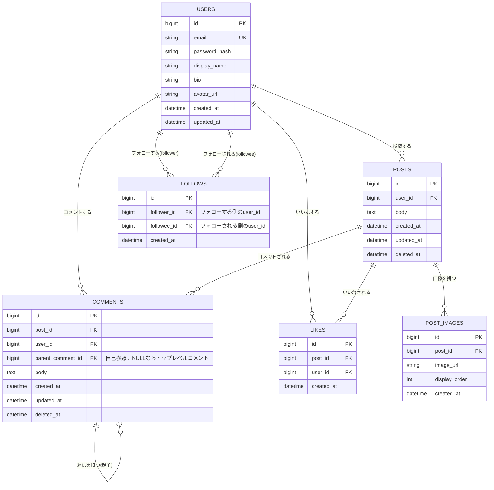

# ER図

## 補足

- `LIKES` は `(post_id, user_id)` の組み合わせで一意制約を設け、同一ユーザーが同一投稿に重複していいねできないようにする。
- `FOLLOWS` は `(follower_id, followee_id)` の組み合わせで一意制約を設け、重複フォローを防止する。
- `COMMENTS.parent_comment_id` はコメントへの返信(ネスト)を表現する自己参照外部キー。NULLの場合は投稿に対する直接コメント。
- 投稿数・コメント数・いいね数は都度カウントするか、非正規化してキャッシュ列(例: `POSTS.like_count`, `POSTS.comment_count`)を持たせるかは実装フェーズで検討する。
